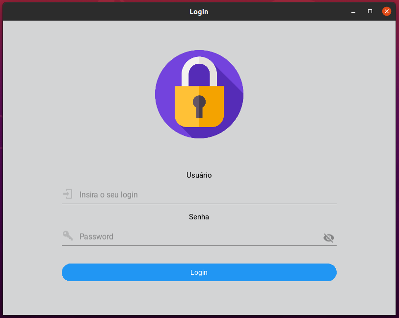
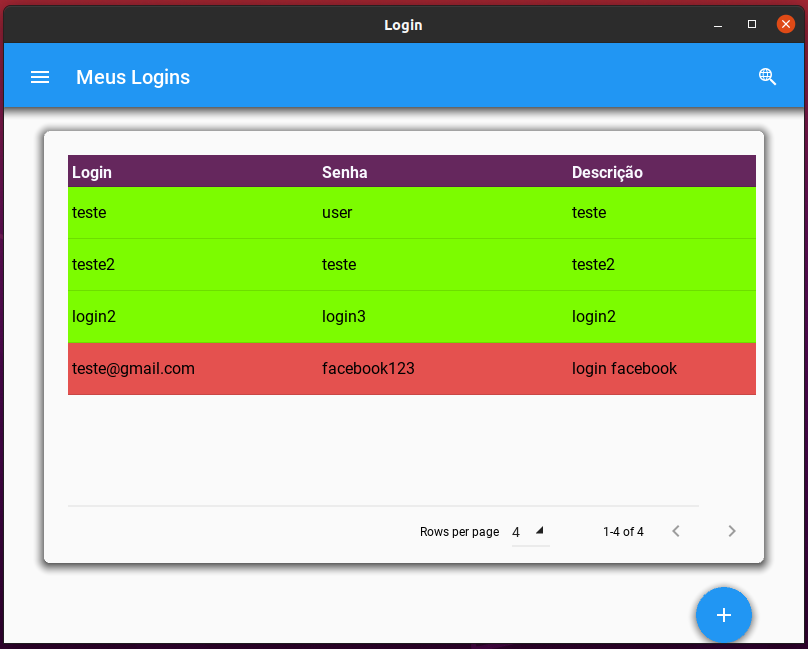

# Gerenciador de senhas
*Gerenciador de senhas, sites e emails simples feito em python.*

# How to use

## Install
- python -m virtualenv venv
- source venv/bin/activate
- pip install -r requirements.txt
- pip install https://github.com/kivymd/KivyMD/archive/master.zip

## Env
- create .env file on root folder
- put SECRET_KEY="your-secret-key"

## Run
- python3 main.py

*Tela de login*

*Exemplo de exibição das senhas sem criptografia.*

Observações sobre o código:
<blockquote> O intuito principal do código é agilizar e organizar seus sites, emails, e senhas de forma prática.
O código está aí para quem quiser fazer mudanças. Deixem os créditos e obrigado.</blockquote>
